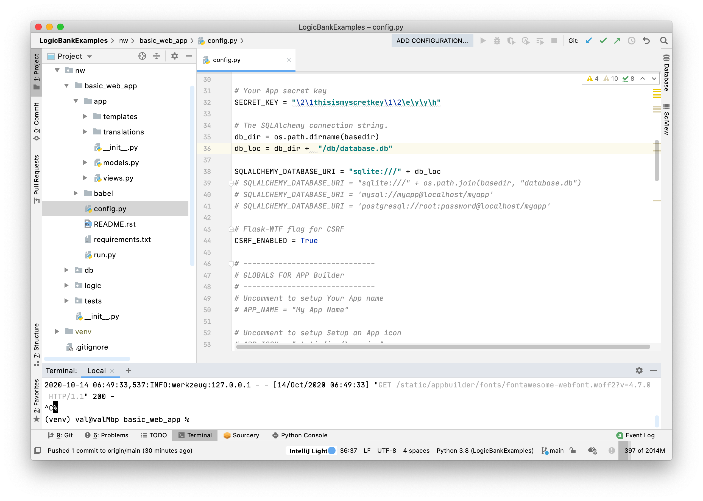

This project is a complement to [logicbank](https://github.com/valhuber/logicbank),
which explains the concepts of rules, as well being used for 
development of `logicbank`.

Here we focus on the practicalities of installation and configuration,
with 2 (unrelated) samples (copied from LogicBank):
* `nw`
* `banking`

This page shows the common install / configure tasks common to both.
In both cases, they use [fab-quickstart](https://github.com/valhuber/fab-quick-start),
which is optional but recommended since it makes it really
easy to explore your database.


## Installing

### Verify Pre-reqs: Python 3.8, virtualenv, pip3
Ensure you have these pre-reqs
```
python --version
# requires 3.8 or higher

pip --version
# version 19.2.3 or higher... you might be using pip3

pyenv --version
# 1.2.19 or higher
```

If you are missing any, install them as [described here](https://github.com/valhuber/LogicBank/wiki/Explore-Logic-Bank).
We also recommend an IDE such as PyCharm, VSCode, etc.

### Install `logicbankexamples`
In your IDE or Command Line:

```
# optionally fork, and then
git clone https://github.com/valhuber/LogicBankExamples.git
cd LogicBankExamples
virtualenv venv
# windows: .\venv\Scripts\activate
source venv/bin/activate
pip install -r requirements.txt
```

#### Verify and Run

##### Run `basic_web_app`

```
cd LogicBankExamples
cd nw/basic_web_app
# windows set FLASK_APP=app
export FLASK_APP=app
flask run
```
You then start the app (use **new window**) with [`http://127.0.0.1:5000/`]( http://127.0.0.1:5000/)
> **Login** (upper right): user = admin, password = p

You can
1. Navigate to Order 11011 (a _multi-page_ web app)
    * Click **Menu > Customer List** 
    * Click the **magnifying glass** for the first customer
    * Click the **List Order tab**
    * Click the **magnifying glass* for Order **11011**
2. Click Edit so you can make changes
3. Change the Shipped Date
4. Click save
5. Verify logic enforcement
    * The web app has been [configured](https://github.com/valhuber/LogicBank/wiki/Flask-App-Builder-Integration) to activate the rules
    * The logic for this update [is interesting](https://github.com/valhuber/LogicBank/wiki/home#example-ship-order---pruning-adjustment-and-cascade) -
    check out the console log

##### Run the `nw/tests`
Run the `nw/tests` programs under your IDE or the
command line; start with `add_order` and `upd_order_shipped,`
and see the [walk-throughs here](https://github.com/valhuber/LogicBank/wiki).

```
cd nw/tests
python add_order.py
```

> Note: the **log** depicts logic execution


## Project Setup Cookbook
This project has already been set up.  Here's how we did it.
We'll be using `nw` as an example.

#### Create Environment
```
# create your project root (check this into scs)
mkdir nw
cd nw
virtualenv venv
# configure SCS to ignore venv
# windows venv\Scripts\activate
source venv/bin/activate

(venv)$ pip install logicbank
(venv)$ pip install SQLAlchemy
(venv)$ pip install sqlacodegen

# if using fab
(venv)$ pip install flask-appbuilder
(venv)$ pip install fab-quick-start

```

#### Creating a New Project
We'll recreate the `logicbankexamples`.
We'll follow the same structure to make things definite,
so you can compare.
Of course, use whatever structure you like,
here's how we did it for `nw` and `banking`:

```
# in nw...
(venv)$ mkdir nw_logic
(venv)$ mkdir db
```

#### Create Models

There are many ways to create models.
* You can create the models file by hand,
and use that to generate the database, or
* You can use an existing database, and
create a models file to match it.

For existing databases, consider using
[`sqlacodegen`](https://pypi.org/project/sqlacodegen/).
Here, we'll use `nw` as our example;
we already have a sqlite database in our `nw/db` folder
([download a copy](/nw/db/database.db)) so:

```
(venv)$ cd db
(venv)$ sqlacodegen sqlite:///database.db --noviews > nw/nw_logic/app/models.py
```
The first parameter identifies your database location;
consult the sqlacodegen documentation.

##### Important notes about models - mind the relationships
Both `logicbank` and `fab-quickstart` depend on
relationships.  Ideally, they exist in your database,
in which as `sqlcodegen` will find them.  If that's
not practical, SQLAlchemy also lets to define them in your models:
  * declare the **foreign keys**, eg, Orders has a foreign key to customers
    * `CustomerId = Column(ForeignKey('Customer.Id'))`
  * declare the **references** in the parent (not child), eg, declare orders
  for customer like this
    * `OrderDetailList = relationship("OrderDetail", backref="OrderHeader", cascade_backrefs=True)`

## Declaring Logic as Spreadsheet-like Rules
To illustrate, let's use an adaption
of the Northwind database,
with a few rollup columns added.
For those not familiar, this is basically
Customers, Orders, OrderDetails and Products,
as shown in the diagrams below.

##### Declare rules using Python
Logic is declared as spreadsheet-like rules as shown below
from  [`nw/nw_logic/nw_rules_bank.py`](nw/logic/rules_bank.py),
which implements the *check credit* requirement:
```python
def declare_logic():
    """ Check Credit Requirement:
        * the balance must not exceed the credit limit,
        * where the balance is the sum of the unshipped order totals
        * which is the rollup of OrderDetail Price * Quantities:
    """

    Rule.constraint(validate=Customer, as_condition=lambda row: row.Balance <= row.CreditLimit,
                    error_msg="balance ({row.Balance}) exceeds credit ({row.CreditLimit})")
    Rule.sum(derive=Customer.Balance, as_sum_of=Order.AmountTotal,
             where=lambda row: row.ShippedDate is None)  # *not* a sql select sum
    
    Rule.sum(derive=Order.AmountTotal, as_sum_of=OrderDetail.Amount)
   
    Rule.formula(derive=OrderDetail.Amount, as_expression=lambda row: row.UnitPrice * row.Quantity)
    Rule.copy(derive=OrderDetail.UnitPrice, from_parent=Product.UnitPrice)
```


##### Activate Rules
To test our rules, we use
[`nw/tests/add_order.py`](nw/tests/add_order.py).
It activates the rules using this import:
```python
from nw.nw_logic import session  # opens db, activates logic listener <--
```
 
This executes [`nw/logic/__init__.py`](nw/logic/__init__.py),
which sets up the rule engine:
```python
by_rules = True  # True => use rules, False => use hand code (for comparison)
if by_rules:
    LogicBank.activate(session=session, activator=declare_logic)
else:
    # ... conventional after_flush listeners (to see rules/code contrast)
```

## FAB Quick Start
[Python Flask Application Builder (fab)](https://flask-appbuilder.readthedocs.io/en/latest/)
creates "basic" applications for database crud operations quickly,
with minimal coding.  Typical fab pages can look like this:

1. __Multi-page:__ apps include 1 page per table
1. __Multi-table:__ pages include `related_views` for each related child table, and join in parent data
1. __Favorite field first:__ first-displayed field is "name", or _contains_ "name" (configurable)
1. __Predictive joins:__ favorite field of each parent is shown (product _name_ - not the foreign key `product_id_`)
1. __Ids last:__ such boring fields are not shown on lists, and at the end on other pages

<figure><figcaption>Multi-Table Page</figcaption></figure>


***


#### 1 - Create Empty fab Project
Create a default empty FAB app:
```
# cd to nw folder
(venv)$ flask fab create-app
```
You will then be prompted for the project name and your db engine type.  When prompted:
* Use the default engine
* Name the project `basic_web_app`

You should see a structure as shown in the screen shot in the next section.

We now have a well-formed empty project.  We now need to acquire and __configure a database__, set up SQLAlchemy ORM __`models.py`__, and define our pages with __`views.py`__.

#### 2 - Configure Database
Update your `nw/basic_web_app/config.py` file to denote this database name (illustrated below).
Your project will look something like this:

<figure><figcaption>Project Structure</figcaption></figure>

##### Key FAB inputs can become tedious: `models.py` and `views.py`
FAB requires that we edit __2 key files__ to make our "empty" project interact with the database.  These can get __tedious,__ due to per-page code required for _each_ table / page.  For more information, [see here](https://github.com/valhuber/fab-quick-start/wiki/Tedious-per-page-code).

The following sections show how to __use generators to avoid the tedious hand creation__ of the `views.py` and the `models.py` files.

#### 3 - Create `models.py`
We have already created our `models.py` file.
However, it has not been been discovered how to use it,
so copy the `models.py` to your `nw/app` folder.

#### 4 - Define `views.py`
Finally, we need to define some pages.  That's also a bit of work to do that by hand, so let's use __fab-quick-start__
to create the `views.py` file from the `app/models.py` file (__hit enter__ to accept defaults when prompted):

```
(venv)$ fab-quick-start run --favorites="name description" --non_favorites="id" > app/views.py
```
This overwrites your `nw/basic_web_app/app/views.py` file.  For more information, see the [FAB Quick Start Utility docs](https://github.com/valhuber/fab-quick-start#readme).

#### 5 - Create Admin
The FAB system can create tables in your database for authenticating and authorizing users (tables such as `ab_user`, `ab_user_role`, etc).  You create these as follows (Username: `admin`, Password: `p`):
```
(venv)$ export FLASK_APP=app
(venv)$ flask fab create-admin
Username [admin]:
User first name [admin]:
User last name [user]:
Email [admin@fab.org]:
Password:
Repeat for confirmation:
```
Ignore the error "user already exists", since the admin data was pre-loaded.

You can verify your data and admin data like this (mac/unix only):
```
sqlite3 nw.db  # mac only
> .tables
> .schema Order
> select * from ab_user;
> select * from Territory;
> .quit
```

#### 6 - Run `nw` App
You've now created a app with a dozen pages or so; run it like this:
```
(venv)$ # still cd'd to basic_web_app
(venv)$ export FLASK_APP=app
(venv)$ flask run
```
Start your browser [here](http://127.0.0.1:5000/).

